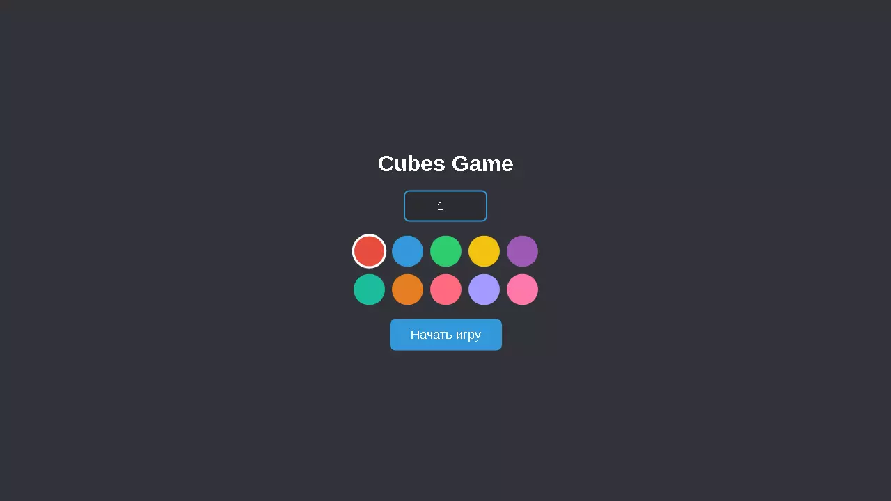

[Русский](README.md) | [English](README.en.md)

# Cubes Game

Мультиплеерная браузерная игра с кубиками на Canvas.

## Установка

```bash
curl -sL https://raw.githubusercontent.com/psevdonimux/cubes-game/main/installer.sh | bash
```

## Настройка

1. Отредактируйте `.env`:
```
DB_HOST=localhost
DB_USER=root
DB_PASS=your_password
DB_NAME=box
```

2. Запустите MariaDB:
```bash
mysqld_safe &
```

3. Создайте пользователя (первый запуск):
```bash
mysql -u root
ALTER USER 'root'@'localhost' IDENTIFIED BY 'your_password';
FLUSH PRIVILEGES;
exit
```

4. Запустите PHP сервер:
```bash
php -S localhost:8080
```

## Скриншоты

| Меню |
|------|
|  |

| Игра |
|------|
|  |

## Требования

- PHP 8.0+
- MariaDB 10.5+
